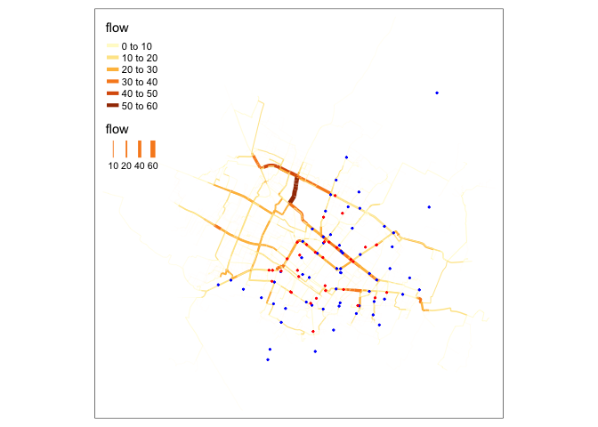

## Project description

### Intro

The objective of this project is to propose a methodology to locate new
Oxxo convenience stores in the city of Colima, Colima, in Mexico. It
uses a mix of graph theory, transport modelling and GIS tools.

``` r
print(x)
```



### Network analysis

In development

### Isochrones

Isochrones are generated using the network and the locations of existing
stores. The convenience store market is currently covered by Kiosko,
Seven Eleven and Oxxo, which are the three main participants in the
city. There is also influence of local stores.  
The process consists in calculating isochrones for each store in
different time values across the network (2, 5, 10 and 15 minutes) and
then combining the resulting polygons into one, which represents the
catchment area for each time limit considering all the stores in
service. The region outside this catchment area is considered not to
have ideal accessibility to a convenience store.
